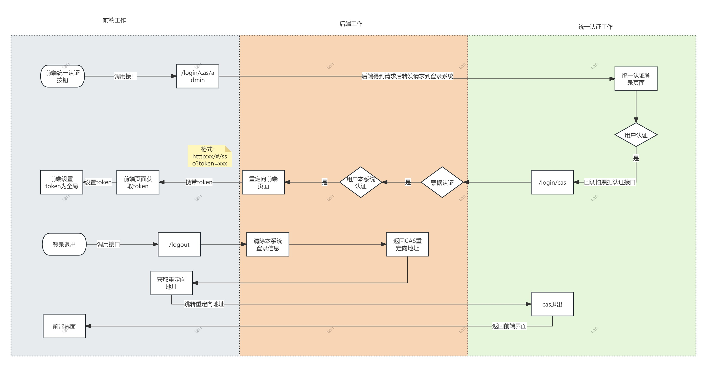

# use


## 接口代码
```java

@Tag(name = "登录管理", description = "登录管理",
        extensions = {
                @Extension(properties = {
                        @ExtensionProperty(name = "x-order", value = "1", parseValue = true)
                })
        })
@RestController
@RequestMapping
@RequiredArgsConstructor
@Slf4j
public class LoginController {
    private final CasService casService;


    /**
     * <code>
     *       handleToCAS() {
     *           window.location.href = `${process.env.VUE_APP_BASE_API}/login/cas/admin`
     *       }
     * </code>
     */
    @ApiMapping(value = "/login/cas/admin", method = RequestMethod.GET, checkToken = false)
    @Operation(summary = "第一步：前端统一认证登录按钮出发的请求接口", description = "统一认证")
    @ApiOperationSupport(order = 1)
    public void loginCasWeb(HttpServletResponse response, HttpServletRequest request) throws IOException {
        CasConfig casConfig = casService.getCasConfig();
        String loginUrl = casConfig.fullLoginUrl() + "?service=" + casConfig.jRedirect();
        response.sendRedirect(loginUrl);
    }

    @ApiMapping(value = "/login/cas", method = RequestMethod.GET, checkToken = false)
    @Operation(summary = "第二步：统一认证成功后的跳转地址", description = "cas票据认证")
    @ApiOperationSupport(order = 2)
    public void loginCas(HttpServletResponse response, HttpServletRequest request, String ticket) throws IOException {
        JsonObject userJson = casService.verifyTicket(ticket);
        CasConfig casConfig = casService.getCasConfig();
        String teacherNo = userJson.get("user_no").getAsString();
        Customer customer = customerService
                .finCustomer(teacherNo)
                .orElseThrow(() -> new UserException("当前账户不支持登录本系统，请联系管理员"));
        String sign = loginUserSign(customer, request, Collections.singletonList(PlatformConstant.WEB_ADMIN), LoginType.ADMIN_ACCOUNT_CAS);
        response.sendRedirect(casConfig.vRedirect() + "?token=" + sign);
        // 设置 Cookie
        //        Cookie cookie = new Cookie("cas_token", sign);
        //        response.addCookie(cookie);
        //        response.sendRedirect(casConfig.vRedirect());
    }


    /**
     * <code>
     *     <script>
     *          import { getToken } from '@/utils/auth'
     *          export default {
     *              async created() {
     *                 const { query } = this.$route
     *                  if (query.token) {
     *                      await this.$store.dispatch('user/setToken', query.token)
     *                      this.$router.replace({ path: '/' })
     *                  } else if (getToken()) {
     *                      this.$router.replace({ path: '/' })
     *                  } else {
     *                      location.href = `${process.env.VUE_APP_BASE_API}/login/cas/admin`
     *                  }
     *              },
     *          render: function(h) {
     *          return h() // avoid warning message
     *          }
     *      }
     *     </script>
     * </code>
     */
    @Operation(summary = "退出")
    @GetMapping("/logout")
    public ResultVO<String> logout(HttpServletResponse response, HttpServletRequest request) throws IOException {
        redisLoginService.loginOut(request);
        // 清除后端会话
        request.getSession().invalidate();
        casService.loginOut(request, response);
        //        // 重定向到 CAS 的登出接口
        CasConfig casConfig = casService.getCasConfig();
        // 本地调式用的，前端判断data是否为空，空就不 location.href
        if (Boolean.TRUE.equals(casConfig.getDescription())) {
            return ResultVO.success("退出成功",
                    casConfig.fullLogoutUrl() + "?service=" + casConfig.logoutRedirect());
        } else {
            return ResultVO.successMessage("退出成功");
        }
    }
}
```
## 配置文件
```yaml
jdevelops:
  cas:
    service: https://cas.tan.cn
    validate: /cas/serviceValidate
    login: /cas/login
    logout: /cas/logout
    api-url-prefix: http://127.0.0.1:9019
    web-url-prefix: http://127.0.0.1:9528/tan
    redirect-logout: false
    web-logout-page: "/#/login"
    web-parsing-token-page: "/#/sso"
```
